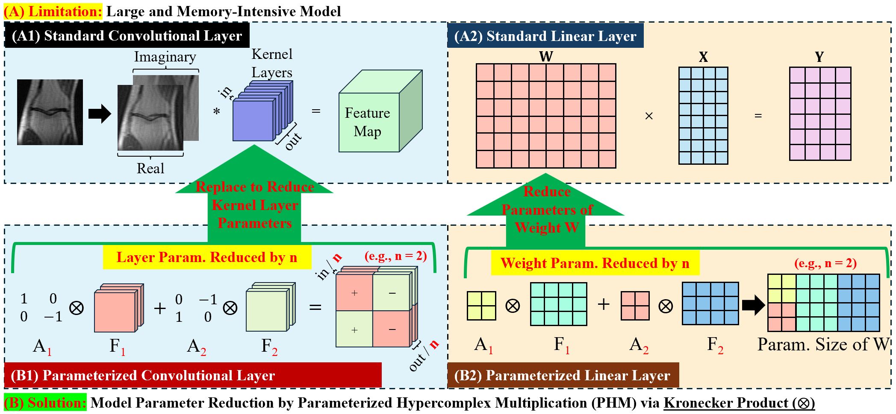

# 🧠 HyperKron-MRI-Recon

> **Official PyTorch implementation of**  
> **"Lightweight Hypercomplex MRI Reconstruction: A Generalized Kronecker-Parameterized Approach" (MICCAI 2025)**  
> 🎓 Imperial College London · King's College London · Royal Brompton Hospital

---

## 📌 Overview

**Magnetic Resonance Imaging (MRI)** plays a vital role in clinical diagnostics, yet its prolonged scan times remain a challenge. This repository introduces a **lightweight, hypercomplex neural network framework** that drastically reduces model size **via Kronecker-Parameterized Layers**, enabling efficient MRI reconstruction under tight hardware constraints.

<div align="center">
  
  <br />
  <b>Fig.1: Parameter reduction through Kronecker-based Hypercomplex Multiplication (PHM)</b>
</div>

---

## 🚀 Highlights

- 📦 **50% parameter reduction** with no significant drop in PSNR, SSIM, or LPIPS
- ⚙️ **Plug-and-play** Kronecker Linear and Convolution layers
- 🤖 Supports both **U-Net** and **Transformer (SwinMR)** architectures
- 📉 Enhanced **generalization on small datasets**, less prone to overfitting

---

## 🧪 Key Components

| Module                     | Description                                          |
|---------------------------|------------------------------------------------------|
| 🔷 Kronecker Linear Layer  | Parameter-efficient MLP using PHM                   |
| 🔶 Kronecker Convolution   | Reduces kernel size via Kronecker factorization     |
| 🧱 Kronecker U-Net         | Lightweight convolutional network                   |
| 🔳 Kronecker SwinMR        | Transformer-based model with PHM attention & MLP    |

---

## 📊 Results

### 📉 Validation Loss Comparison (Limited Data)

<div align="center">
  
  <br />
  <b>Kronecker U-Net generalizes better than standard U-Net under limited data.</b>
</div>

### 🖼️ Reconstruction Comparison

<div align="center">
  
  <br />
  <b>Visualization of reconstructed images under 16× acceleration.</b>
</div>

---

## 🛠️ Installation

```bash
git clone https://github.com/yourusername/HyperKron-MRI-Recon.git
cd HyperKron-MRI-Recon
pip install -r requirements.txt
